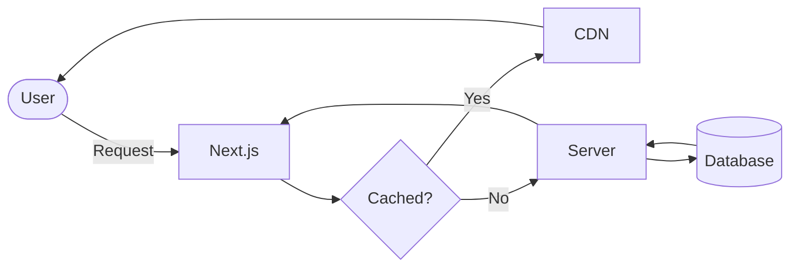

Welcome to your new MDX-powered blog. This post demonstrates every feature available.

## Syntax Highlighting

Code blocks use **Shiki** for server-side highlighting with dual light/dark themes.
Hover the block to copy.

```typescript title="lib/example.ts" {3-5}
// Lines 3-5 are highlighted
interface User {
  id: string
  name: string
  email: string
}

async function getUser(id: string): Promise<User> {
  const res = await fetch(`/api/users/${id}`)
  return res.json()
}
```

```bash
npm install next-mdx-remote rehype-pretty-code shiki
```

## Callouts

<Callout type="info" title="Pro tip">
  Use callouts to highlight important information. They support `inline code`
  and **bold text** too.
</Callout>

<Callout type="warning">
  Omit the `title` prop to use the default label for each type.
</Callout>

<Callout type="success" title="You're all set!">
  The MDX pipeline is ready to use. Start writing content in the `content/`
  directory.
</Callout>

<Callout type="error" title="Don't do this">
  Never commit secrets to your repository.
</Callout>

<Callout type="tip">
  Use `<Callout type="tip">` for helpful suggestions.
</Callout>

## Mermaid Diagrams

<Mermaid caption="Request lifecycle in a Next.js app">



</Mermaid>

## Tables

GitHub Flavored Markdown tables work out of the box.

| Feature             | Status | Notes                     |
| ------------------- | ------ | ------------------------- |
| Syntax highlighting | ✅     | Shiki, dual theme         |
| Mermaid diagrams    | ✅     | Client-side render        |
| Math (LaTeX)        | ✅     | via KaTeX                 |
| Callout boxes       | ✅     | 5 types                   |
| Table of contents   | ✅     | Auto-extract + scroll spy |
| Task lists          | ✅     | remark-gfm                |

## Math

Inline math: $E = mc^2$

Display math:

$$
\int_{-\infty}^{\infty} e^{-x^2} dx = \sqrt{\pi}
$$

## Task Lists

- [x] Install dependencies
- [x] Configure `next.config.ts`
- [x] Add `mdx.css` to globals
- [ ] Write your first blog post
- [ ] Deploy to production

## Blockquote

> The best documentation is the one that doesn't need to be read, but when it does need to be read, it is clear and concise.

## That's it!

Your MDX pipeline is production-ready. Start creating content in `content/blog/`, `content/projects/`, and `content/privacy-policy.mdx`.
