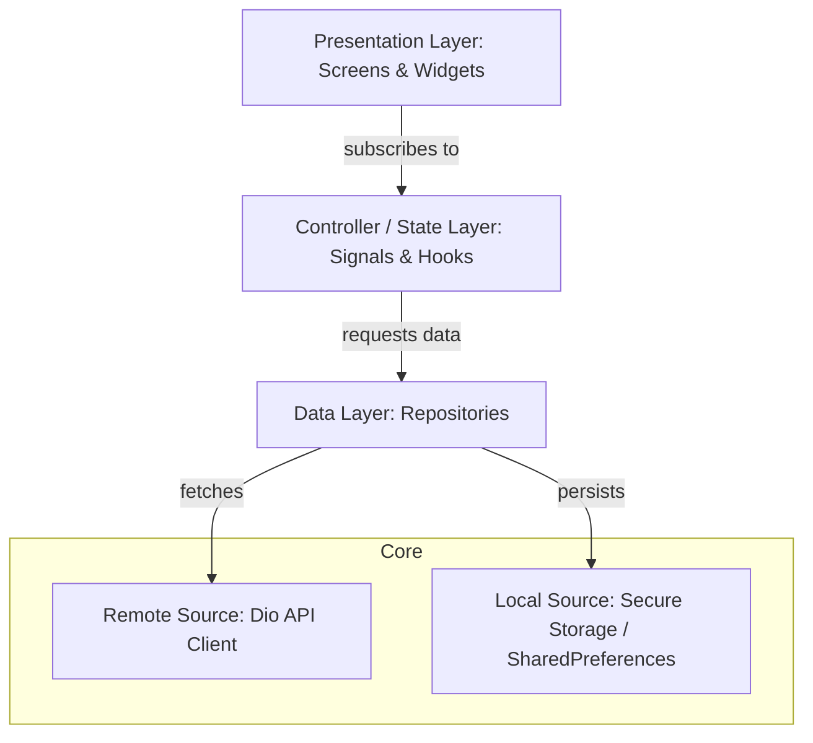

# Poco Myanmar — Field Sales & Operations Platform

A production-grade, role-based Flutter application designed to orchestrate field sales, track inventory, and aggregate hierarchical performance metrics for **Poco Myanmar (Astra Wealth)**.

---

## 🚀 Project Overview

**Poco Myanmar** is a robust, enterprise-focused field operations tool built to streamline mobile sales tracking, inventory management, and regional performance reporting. The platform bridges the gap between ground-level promoters, regional supervisors, and executive directors by delivering a role-aware operational dashboard with offline capabilities, barcode/IMEI scanning, and real-time analytical insights.

- **Role-Based Experience:** Custom UI flows tailored to 6 distinct roles (Promoters, Sale Supervisors, ASMs, RSMs, Trainers, and Sale Directors).
- **Offline-First Intake:** IMEIs and stock assignments can be scanned and saved as local drafts, preventing data loss in areas with spotty network coverage.
- **Enterprise Reporting:** Multi-level hierarchical traversal allowing regional managers to drill down from country-wide metrics down to individual promoter transactions.

---

## 🏛️ System Architecture

The application adopts a **feature-first, layered architecture** combined with a modular package setup (monorepo structure) to enforce strict separation of concerns and maintainable dependency flow.



### Modular Directory Structure

```text
lib/
├── app/                  # App initialization, Dependency Injection (GetIt), App Router
├── core/                 # Shared widgets, themes, HTTP client, API exceptions, utility hooks
├── features/             # Feature-specific modules (Presentation, Controllers, Repositories)
│   ├── auth/             # Session lifecycle, device registration metadata, secure login
│   ├── home/             # Dynamic dashboard widgets loaded by role
│   ├── sales/            # Sales upload with warranty card photo, sales history
│   ├── sale_reports/     # Hierarchical sales and KPI traversal (Promoter -> Supervisor -> ASM -> RSM)
│   ├── sale_director/    # Executive regional dashboards and upper/lower Myanmar scope controls
│   ├── stock_upload/     # IMEI intake, shop assignments, and promoter draft management
│   ├── notifications/    # Inbox with local unread state tracking
│   ├── scanner/          # Reusable barcode/IMEI camera scanner
│   └── shops/            # Shop loading and dropdown filtering
└── packages/             # Separately compiled local helper packages
    ├── app_device/       # Resolves hardware & OS metadata for login/audits
    ├── app_storage/      # Encryption-enabled key-value storage layer
    ├── app_push/         # Firebase Cloud Messaging token and local notification engines
    └── app_logger/       # Unified logging wrapper powered by Talker
```

---

## 🛠️ Technical Stack

| Category                 | Technology / Library                   | Role in Project                                                             |
| :----------------------- | :------------------------------------- | :-------------------------------------------------------------------------- |
| **Framework**            | **Flutter 3.41.6**                     | Multiplatform app runtime (compiled for Android & iOS)                      |
| **Language**             | **Dart 3.11.4**                        | Strong-typed, asynchronous application logic                                |
| **State Management**     | **Signals + Flutter Hooks**            | Reactive state propagation with declarative, lifecycle-aware UI composition |
| **Routing**              | **Go Router**                          | Centralized, type-safe, and role-guarded route engine                       |
| **Dependency Injection** | **GetIt**                              | Service locator for decoupled registration of repositories and services     |
| **Networking**           | **Dio**                                | HTTP client with automatic headers, error interceptors, and logging         |
| **Local Storage**        | **Secure Storage + SharedPreferences** | Encrypted token storage and device preferences                              |
| **Localization**         | **Easy Localization**                  | Real-time translation between English (`en`) and Myanmar (`mm`)             |
| **Push Notifications**   | **FCM + Local Notifications**          | Background event execution and foreground banner updates                    |
| **Analytics/Charts**     | **FL Chart**                           | Interactive data visualization for executive analytics dashboards           |
| **Scanner**              | **Mobile Scanner**                     | Camera-based barcode/IMEI identification and confirmation                   |

---

## ✨ Key Features & Technical Highlights

### 1. Dynamic Role-Based Dashboards

The application dynamically alters its architecture, API routes, and presentation layers based on the authenticated employee's role.

- **Promoters:** Focus on daily sale uploads, stock-in counts, and personal target achievements.
- **Supervisors / ASMs / RSMs:** View aggregated team KPI achievements, manage stock assignments to retail counters, and drill down into individual subordinate performance.
- **Sale Directors:** Focus on country-wide and regional analytics (Upper/Lower Myanmar), with high-level sales trends visualized via charts.

### 2. High-Performance State Management

By pairing **Signals** (reactive variables) with **Flutter Hooks**, the application benefits from:

- **Fine-Grained Re-builds:** Only the widgets specifically reading a signal re-render, keeping CPU usage low during complex list filtering.
- **Boilerplate Elimination:** Avoided massive boilerplate code associated with BloC or Redux while keeping logic decoupled from the visual UI tree.
- **Memory Leak Protection:** Native hook lifecycles ensure controllers, text editors, and camera streams are disposed of automatically.

### 3. Encapsulated Local Workspace Packages

Rather than bloating the main app target, low-level platform operations are isolated into local packages located under `/packages`:

- **`app_storage`**: Provides a unified interface that routes key-value settings to `shared_preferences` and session keys to `flutter_secure_storage`.
- **`app_device`**: Seamlessly reads hardware serial numbers, OS versions, and app identifiers to verify the device during login audits.
- **`app_logger`**: Standardizes console outputs and network request logs using a configurable wrapper.

### 4. Barcode/IMEI Scanning & Verification

Enforces validation on the inventory intake process:

- Features an custom camera overlay with manual override options.
- Throttles detector triggers to prevent duplicate scans.
- Reconciles inputs with existing counter stock prior to uploading sales, mitigating human error during data entry.

---

## 🛠️ Environmental Flavors & CI/CD Setup

To ensure strict division between testing and production resources, the project employs **Android Product Flavors** linked with separated Firebase projects:

| Flavor          | Package ID                              | Config File        | API Targeting                          |
| :-------------- | :-------------------------------------- | :----------------- | :------------------------------------- |
| **Development** | `com.astralwealth.poco_myanmar.app.dev` | `.env.development` | Staging API Gateway / Dev Firebase     |
| **Production**  | `com.astralwealth.poco_myanmar.app`     | `.env.production`  | Production API Gateway / Prod Firebase |

---

## 📈 Key Engineering Achievements

1. **Clean Architecture Compliance:** Implemented clean boundary layers between UI (`HookWidget`), business logic (`Controller`), data caching (`Repository`), and raw REST protocols (`ApiClient`).
2. **Reliable Test Coverage:** Broad unit testing coverage for critical components like routers, guards, state controllers, and JSON models, ensuring regression-free development cycles.
3. **Optimized Layout Performance:** Dashboard widgets are presentation-only helpers that consume prepared data props, ensuring rendering remains smooth and layout passes are minimized.
