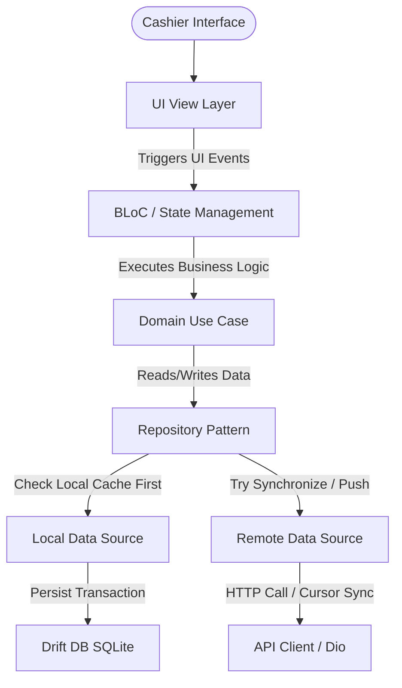

# Cannopy POS — Enterprise-Grade Local-First Retail Point of Sale

**Cannopy POS** is a production-grade, offline-first mobile Point of Sale (POS) application tailored for retail operations. Engineered using Flutter and Dart, the application is designed to operate seamlessly in connectivity-challenged environments (e.g., brick-and-mortar stores, remote markets) by prioritizing local database states, employing automated cursor-based synchronization, and leveraging peer-to-peer (P2P) LAN data transfer when external internet access is down.

---

## 🚀 Key Technical Highlights

- **Local-First Runtime Architecture:** All critical business transactions, checkout states, inventory updates, and cashier shifts are managed locally via [Drift (SQLite)](file:///Users/mixin/Projects/Cannopy/cannopy_pos/packages/app_database/lib/app_database.dart) before being synchronized with the cloud.
- **Peer-to-Peer LAN Synchronization:** Built-in TCP/IP master-slave packet replication allows offline POS registers to synchronize sales, inventory, and database states across a Local Area Network (LAN) using socket bridges, removing reliance on external APIs.
- **Enterprise-Grade Clean Architecture:** Strict separation between Presentation (BLoC), Domain (UseCases, Entities), and Data (Repositories, DAOs) layers ensures testing isolation and independent layer maintenance.
- **Dynamic Session & Lock Lifecycle:** Real-time inactivity tracking, shift-based operations, and role-based access control (RBAC) with local PIN validation ensure high-security cashier drawer operations.
- **Hardware Integration & Printing:** Custom native integrations for Bluetooth/LAN thermal receipt printers (ESC/POS formatting) and barcode scanners.

---

## 🛠️ Tech Stack & Workspace Structure

Cannopy POS is organized as a **Dart pub workspace** containing high-cohesion, low-coupling packages to facilitate code reuse and modularity:

| Module / Package                   | Purpose                                                                                      | Core Technologies                              |
| ---------------------------------- | -------------------------------------------------------------------------------------------- | ---------------------------------------------- |
| **App Core Container**             | Entry points, bootstrap routing, config, global DI, startup tasks, and shell overlays.       | `go_router`, `get_it`, custom startup runner   |
| **`packages/app_database`**        | Thread-safe database engine, DAOs, schema definitions, and migration path mappings.          | `drift` (SQLite wrapper), code generation      |
| **`packages/app_network`**         | Robust HTTP wrapper featuring automated token refresh intercepts and skip-auth routing.      | `dio`, JSON serialization                      |
| **`packages/app_local_network`**   | Peer-to-peer data transport layer for LAN syncing.                                           | Custom TCP Sockets, Bonsoir NSD                |
| **`packages/app_bluetooth_print`** | ESC/POS thermal printing formatter and peripheral adapter.                                   | Core Bluetooth / Native bridges                |
| **`packages/app_ui_kit`**          | Internal Design System: Custom cards, status dialogues, buttons, and custom layout overlays. | Core Flutter SDK, Canvas, Poppins typography   |
| **`packages/app_logger`**          | Unified console & diagnostic logging.                                                        | `talker` integration                           |
| **`packages/app_storage`**         | Local Key-Value and hardware-backed Secure Storage.                                          | `shared_preferences`, `flutter_secure_storage` |

---

## 📐 Architecture & Runtime Flow

The codebase strictly adheres to **Clean Architecture** patterns. Business logic is separated into decoupled feature modules inside `lib/features/`:

### 1. Presentation Layer (BLoC + View Separation)

Every screen is decoupled into:

- **Screen Widget:** [view/](file:///Users/mixin/Projects/Cannopy/cannopy_pos/lib/app/router/app_router.dart) injects local BLoCs via GetIt dependency injection, triggers initial lifecycle events, and mounts the view content.
- **View Content Widget:** Purely handles UI layout, listens for BLoC state changes (using `BlocListener` for navigation and alerts), and rebuilds stateful UI via `BlocBuilder`.
- **BLoC Container:** Manages state mutations using immutable event-to-state transitions via [Equatable](https://pub.dev/packages/equatable) models.

### 2. Local-First Repository Strategy

To maintain absolute offline operability, repositories implement a cache-first approach:

1. **Reads** are dispatched directly against the Drift database DAOs for instant UI rendering.
2. **Writes** update the local database first and append a transaction record to an outbox sync queue.
3. A background process runs cursor-based synchronizations when network connectivity is detected, ensuring data convergence.

---

## 🧠 Core Engineering Achievements

### 1. Cursor-Based Sync Engine

To maintain consistency between hundreds of distributed POS clients and the central API server, the synchronization system implements a cursor-pull architecture:

- **Bootstrap Phase:** Upon OTP-based login, a device registration payload is sent. The app pulls a complete snapshot of organization, store, product catalog, tax, categories, and unit data.
- **Incremental Sync:** Utilizing transaction cursor markers, the client pulls differences since the last cursor update. On success, the client issues a `sync_ack` back to the server to advance the sync cursor.
- **Image Pre-caching:** Media payloads are parsed asynchronously to download and pre-cache product thumbnails, preventing layout pop during offline operations.

### 2. Local P2P Database Replication

For stores with multiple POS registers operating in zero-internet environments, Cannopy POS features a LAN synchronization mode:

- **Master-Slave Roles:** One POS device is designated as the LAN Host, while secondary terminals act as Receivers.
- **Network Discovery:** The host advertises its socket server using Network Service Discovery (NSD) protocols.
- **Data Transfer Protocol:** Records are serialized, packed, and streamed over raw TCP sockets in packets, using custom handshakes and retry-on-failure protocols to reconcile database tables across devices.

### 3. Bulletproof Shift & Cash Drawer Security

Cashier shifts govern the operational lifecycle of the POS:

- **Active Sessions:** The application enforces shift requirements (Shift In / Shift Out) for cash drawer tracking.
- **Shiftless Operation Fallback:** In custom configurations, cashier presence sessions are validated against secure local employee schemas, enabling POS functions without strict shift constraints.
- **Auto-Lock Security:** Inactivity timers track user input. Upon expiry, the interface locks and requires the cashier's security PIN (locally verified via hashed databases) to resume operations, preventing unauthorized drawer access.

### 4. Custom Calculations & Transaction Flows

The checkout pipeline is custom-built to handle complex retail flows:

- **Splits & Shortfalls:** Handles cash, digital wallets, split payments, and A Kyway (customer debt) options.
- **Loose-Item Settlement:** Dynamic precision calculations for weighted items, integrating rounding rules and change-due balancing.
- **Repayments:** Ledger tracking for customer debt repayments, allocating funds oldest-debt-first and printing dedicated payment receipts.

---

## 🔒 Enterprise Security & Validation

- **Automated Secrets Scanning:** Integrated `gitleaks` verification via git hooks prevents API credentials or private keys from entering the repository.
- **Strict Static Analysis:** A comprehensive ruleset containing over 200 lints (enforcing double quotes, strict typing, const constructor usage, package imports, and trailing commas) is executed on every commit to maintain high codebase quality.
- **Multi-Flavor Environments:** Fully separated environments (`development`, `staging`, `production`) configured via `.env` injection and compile-time Dart defines (`--dart-define`).
