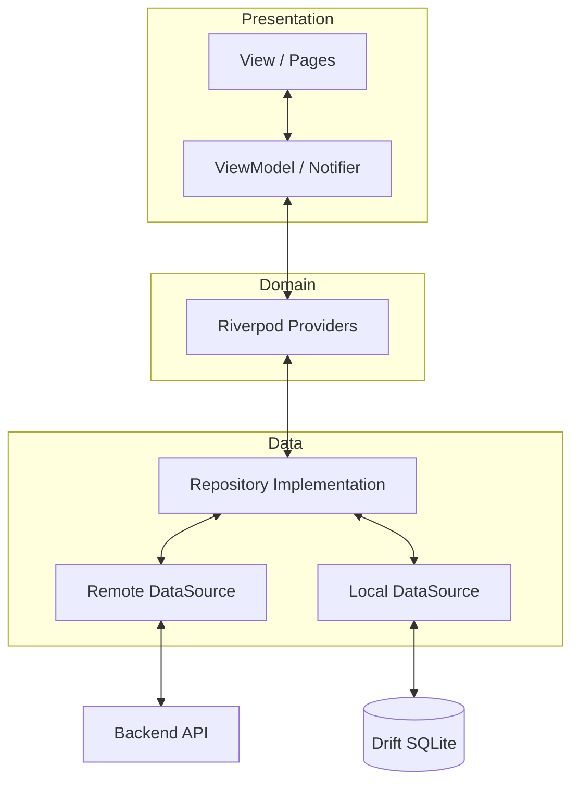

A modern, premium finance wallet application built with Flutter. FinanceWallet helps users manage their finances with a beautiful UI, robust offline-first architecture, and secure biometric authentication.

---

## ✨ Features

- 🔒 **Biometric Security**: Secure your data with fingerprint/face ID authentication.
- 💳 **Account Management**: Support for multiple account types (Cash, Bank, Savings, etc.).
- 💸 **Transaction Tracking**: Easily log income, expenses, and transfers between accounts.
- 📊 **Visual Insights**: Beautifully rendered charts to visualize spending habits.
- 📶 **Offline-First**: Seamlessly access and manage your data with or without internet.
- 🎨 **Premium UI/UX**: Modern design system featuring glassmorphism, dark mode support, and smooth micro-animations.

---

## 🛠 Tech Stack

- **Framework**: [Flutter](https://flutter.dev)
- **State Management**: [Riverpod 3.0](https://riverpod.dev) (using code generation)
- **Navigation**: [Go Router](https://pub.dev/packages/go_router)
- **Local Database**: [Drift](https://drift.simonbinder.eu/) (SQLite)
- **Networking**: [Dio](https://pub.dev/packages/dio) & [Retrofit](https://pub.dev/packages/retrofit)
- **Animations**: [Flutter Animate](https://pub.dev/packages/flutter_animate)
- **Data Visualization**: [FL Chart](https://pub.dev/packages/fl_chart)
- **Dependency Injection**: Riverpod

---

## 🏗 Architecture

The project follow the **MVVM (Model-View-ViewModel)** architectural pattern combined with a robust **Offline-First** strategy.

### Component Relationship



### Key Principles
1. **Unidirectional Data Flow**: State flows down, events flow up.
2. **Offline-First**: Data is always fetched from the local database first, with network updates happening in the background.
3. **Reactive UI**: The UI automatically updates when the underlying data in the database or state changes.

---

## 📁 Project Structure

```text
lib/
├── app/                # App-wide configuration (theme, routes)
├── core/               # Shared utilities, database, and network config
├── features/           # Feature-based modules
│   ├── auth/           # Authentication & Biometric guard
│   ├── dashboard/      # Main overview & charts
│   ├── accounts/       # Account management
│   ├── transactions/   # Transaction logging & filtering
│   └── profile/        # User settings & preferences
└── shared/             # Reusable UI components & extensions
```

---

## 🚀 Getting Started

### Prerequisites
- Flutter SDK `^3.10.4`
- Dart SDK `^3.10.4`

### Installation

1. **Clone the repository**:
   ```bash
   git clone https://github.com/mixin27/finance-wallet.git
   cd finance-wallet
   ```

2. **Install dependencies**:
   ```bash
   flutter pub get
   ```

3. **Run Code Generation**:
   The project uses code generation for models, providers, and database. Run this command to generate the necessary files:
   ```bash
   flutter pub run build_runner build --delete-conflicting-outputs
   ```

4. **Environment Setup**:
   Copy `.env.example` to `.env` and fill in your API configuration (if applicable).

5. **Run the app**:
   ```bash
   flutter run
   ```

---

## 📜 Development Commands

| Command | Description |
|---------|-------------|
| `flutter pub run build_runner watch` | Watch for changes and auto-generate code |
| `flutter test` | Run all unit and widget tests |
| `flutter build apk` | Build production Android APK |
| `flutter build ios` | Build production iOS app |

---

## 📄 License

This project is licensed under the MIT License - see the [LICENSE](LICENSE) file for details.
