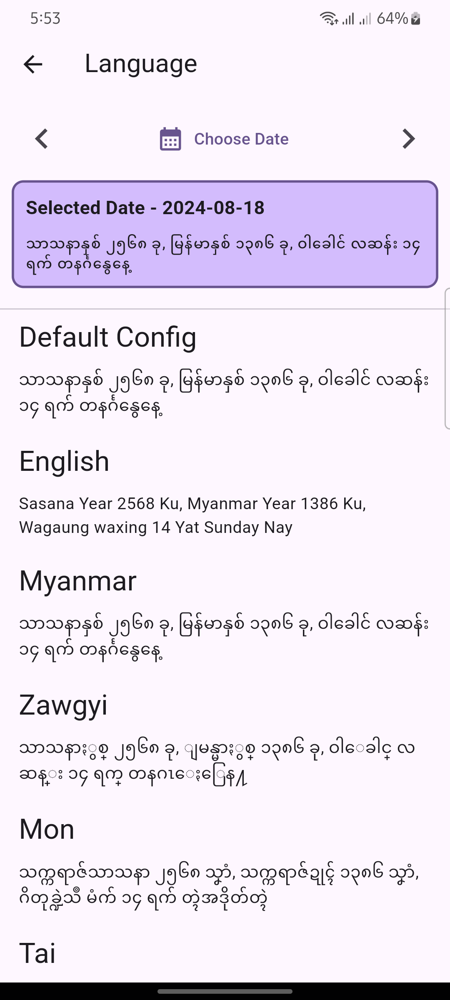
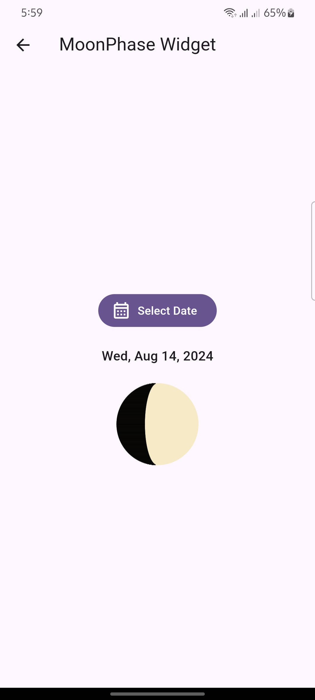
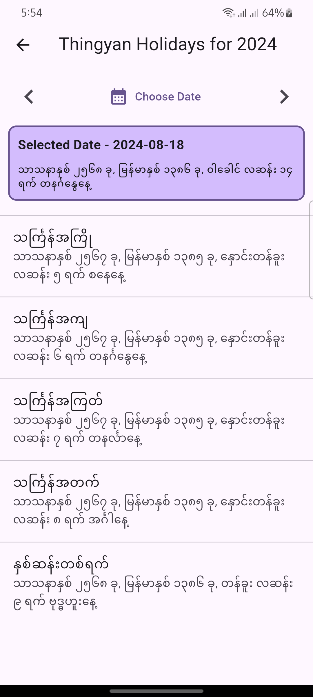

[![License: MIT][license_badge]][license_link]


Package to get **Myanmar** calendar information with `Burmese Astrological Information`, `Holidays` and `Moon phase` widget.

You can check [Myanmar Calendar App](https://github.com/mixin27/mmcalendar) using `flutter_mmcalendar`.

|  |  |
| -------------------------------------------------------------------- | -------------------------------------------------------------------------------------- |
|            |                  |

## Installation 💻

**❗ In order to start using `flutter_mmcalendar` you must have the [Flutter SDK][flutter_install_link] installed on your machine.**

Add `flutter_mmcalendar` to your `pubspec.yaml`:

```yaml
dependencies:
  flutter_mmcalendar:
```

Install it:

```sh
flutter packages get
```

## Features

- `Myanmar Date`
- `Western Date`
- `Astrological Information`
- `Holidays` - Myanmar Thingyan holidays and other holidays.
- `MoonPhase` widget.

## Usage

Import package

```dart
import 'package:flutter_mmcalendar/flutter_mmcalendar.dart';
```

Sample Usage:

```dart
// Default
final mmCalendar = MmCalendar(
  config: MmCalendarConfig.defaultConfig(),
);

// English language config
final mmCalendar = MmCalendar(
  config: MmCalendarConfig.englishLanguage(),
);

// Specific language and calendar type
final mmCalendar = MmCalendar(
  config: const MmCalendarConfig(
    calendarType: CalendarType.gregorian,
    language: Language.myanmar,
  ),
);
```

And use it

```dart
// Get MyanmarDate by year, month and day
final myanmarDate = mmCalendar.fromDate(2023, 10, 19);
```

Available configs:

- `MmCalendarConfig.defaultConfig()`
- `MmCalendarConfig.myanmarLanguage()`
- `MmCalendarConfig.zawgyiLanguage()`
- `MmCalendarConfig.englishLanguage()`
- `MmCalendarConfig.monLanguage()`
- `MmCalendarConfig.karenLanguage()`
- `MmCalendarConfig.taiLanguage()`

Available languages:

- `english`
- `myanmar` - myanmar unicode
- `zawgyi` - myanmar zawgyi
- `mon`
- `karen`
- `tai`

Other usages:

```dart
// Date conversion methods.
final myanmarDate = mmCalendar.fromDateTime(DateTime.now());
mmCalendar.fromDate(2023, 7, 27);
mmCalendar.fromDateAndTime(2023, 7, 27, 10, 30, 01);
mmCalendar.fromJulian(2456599);
final westernDate = mmCalendar.getWesternDateFromJulianDay(2456599);

/// Astrological information
final astro = myanmarDate.astro;
final astroByLanguage = myanmarDate.getAstro(
  languageCatalog: LanguageCatalog.myanmar(),
);
astro.getMahabote();

// All Holidays
List<String> holidays = myanmarDate.holidays;

final resultStr = myanmarDate.formatByPatternAndLanguage(
  pattern: MyanmarDateFormat.simple,
  langCatalog: mmCalendar.languageCatalog,
);
// Output: သာသနာနှစ် ၂၅၆၇ ခု, မြန်မာနှစ် ၁၃၈၅ ခု, သီတင်းကျွတ် လပြည့်  ရက် တနင်္ဂနွေနေ့
// (or)

final resultStr = myanmarDate.formatByPatternAndLanguage(
    pattern: 'S s k, B y k, M p f r En',
    langCatalog: LanguageCatalog(language: Language.english),
);
// Output: Sasana Year 2567 , Myanmar Year 1385 , Thadingyut full moon   Sunday
```

#### Myanmar Date Patterns

Myanmar Date formats are specified by date pattern strings.
The following pattern letters are defined ('S', 's', 'B', 'y', 'k', 'M', 'p', 'f', 'E', 'n', 'r', are reserved):

```dart
// S s k, B y k, M p f r En
MyanmarDateFormat.simple
// S
MyanmarDateFormat.sasanaYear
// s
MyanmarDateFormat.buddhistEra
// B
MyanmarDateFormat.burmeseYear
// y
MyanmarDateFormat.myanmarYear
// k
MyanmarDateFormat.ku
// M
MyanmarDateFormat.monthInYear
// p
MyanmarDateFormat.moonPhase
// f
MyanmarDateFormat.fortnightDay
// E
MyanmarDateFormat.dayNameInWeek
// n
MyanmarDateFormat.nay
// r
MyanmarDateFormat.yat
```

| Letter | Date Component   | Examples Myanmar | Examples English |
| ------ | ---------------- | ---------------- | ---------------- |
| S      | Sasana year      | သာသနာနှစ်        | Sasana Year      |
| s      | Buddhist era     | ၂၅၆၁             | 2561             |
| B      | Burmese year     | မြန်မာနှစ်       | Myanmar Year     |
| y      | Myanmar year     | ၁၃၇၉             | 1379             |
| k      | Ku               | ခု               |                  |
| M      | Month in year    | ဝါခေါင်          | Wagaung          |
| p      | Moon phase       | လဆန်း            | waxing           |
| f      | Fortnight Day    | ၁                | 1                |
| r      | Yat              | ရက်              |                  |
| E      | Day name in week | တနင်္လာ          | Monday           |
| n      | Nay              | နေ့              |                  |

### Astrological Information

```dart
final mmCalendar = MmCalendar(
  config: MmCalendarConfig.myanmarLanguage(),
);

final myanmarDate = mmCalendar.fromDate(2023, 10, 19);
final astro = myanmarDate.astro;

// အမြိတ္တစုတ်
final amyeittasote = astro.getAmyeittasote();

// ရက်ရာဇာ, ပြဿဒါး, မွန်းလွဲပြဿဒါး
final astrologicalDay = astro.getAstrologicalDay();

// "Binga", "Atun", "Yaza", "Adipati", "Marana", "Thike", "Puti"
final mahabote = astro.getMahabote();

// မဟာရက်ကြမ်း
final mahayatkyan = astro.getMahayatkyan();

// "West", "North", "East", "South"
final nagahle = astro.getNagahle();

// နဂါးပေါ်
final nagapor = astro.getNagapor();

// "Ogre", "Elf", "Human"
final nakhat = astro.getNakhat();

// ဥပုသ်
final sabbath = astro.getSabbath();

// ရှမ်းရက်
final shanyat = astro.getShanyat();

// သမားညို
final thamanyo = astro.getThamanyo();

// သမားဖြူ
final thamaphyu = astro.getThamaphyu();

// ဝါရမိတ္တုကြီး
final warameittugyi = astro.getWarameittugyi();

// ဝါရမိတ္တုငယ်
final warameittunge = astro.getWarameittunge();

// ရက်ပုပ်
final yatpote = astro.getYatpote();

// ရက်ယုတ်မာ
final yatyotema = astro.getYatyotema();

// "ပုဿနှစ်", "မာခနှစ်", "ဖ္လကိုန်သံဝစ္ဆိုဝ်ရနှစ်", "စယ်နှစ်", "ပိသျက်နှစ်", "စိဿနှစ်", "အာသတ်နှစ်", "သရဝန်နှစ်",
// "ဘဒ္ဒြသံဝစ္ဆုံရ်နှစ်", "အာသိန်နှစ်", "ကြတိုက်နှစ်", "မြိက္ကသိုဝ်နှစ်"
final yearName = astro.getYearName();
```

You can also check these days by calling `is` prefix properties.

Example:

```dart
// It will return true or false
final isAmyeittasote = astro.isAmyeittasote;
```

### Moon Phase Widget

```dart
MoonPhaseWidget(
  date: DateTime.now(),
  size: 50,
),
```

### Concept reference resources

Algorithm, Program and Calculation of Myanmar Calendar

- [https://cool-emerald.blogspot.com/2013/06/algorithm-program-and-calculation-of.html](https://cool-emerald.blogspot.com/2013/06/algorithm-program-and-calculation-of.html) [(Dr Yan Naing Aye)](https://github.com/yan9a/)

C++ and Javascript Implementation

- [https://github.com/yan9a/mmcal](https://github.com/yan9a/mmcal)

Java Library Implementation

- [https://github.com/chanmratekoko/mmcalendar](https://github.com/chanmratekoko/mmcalendar)

[license_badge]: https://img.shields.io/badge/license-MIT-blue.svg
[license_link]: https://opensource.org/licenses/MIT
[flutter_install_link]: https://docs.flutter.dev/get-started/install
